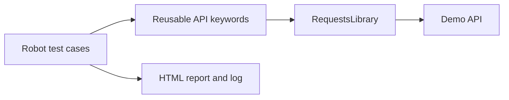

# Architecture


```mermaid
flowchart LR
    T[Robot test cases] --> K[Reusable API keywords]
    K --> R[RequestsLibrary]
    R --> A[Demo API]
    T --> H[HTML report and log]
```

## Sample result

```text
2 tests, 2 passed, 0 failed
report.html and log.html generated in results/
```
